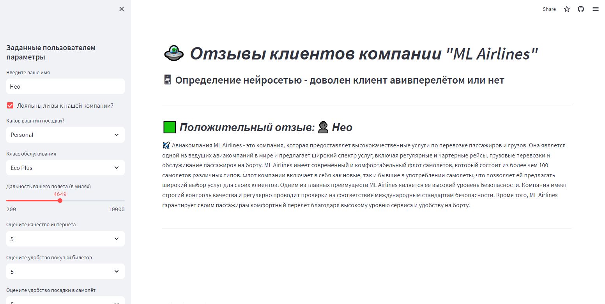
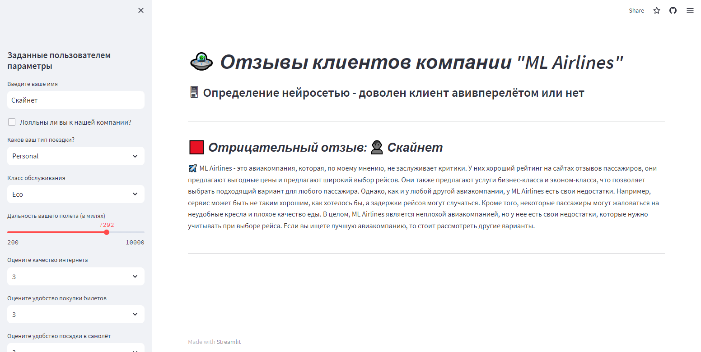

# Симуляция сервиса авиакомпании с отзывами покупателей о полёте

Этот проект призван показать на практике, как моэно применить модель для распознавания 
ситуации - доволен клиент авиаперелётом или нет. А именно - спрогнозировать 
негативный отзыв или нет

---





---

## Файлы

- `app.py`: основной файл с приложением
- `scaler.pkl`: в этом файле хранятся настройки скейлера
- `model.pickle`: в этом файле хранится обученная модель
- `requirements.txt`: все необходимые для запуска модули
- `Berezhnoy_Dmitry_EDA_and_ML.ipynb`: блокнот с EDA и ML

## Запуск приложения

### Терминал

Чтобы запустить приложение из терминала, нужно ввести следующую команду

```shell
streamlit run app.py
```
Необходимо открыть ссылку http://localhost:8501, чтобы увидеть приложение

## Streamlit Cloud Deployment

Готовое приложение по ссылке: https://mlairlinesreviews.streamlit.app/
